<!-- README.md is generated from README.Rmd. Please edit that file -->

<!-- badges: start -->

[](https://github.com/nrennie/ggauto/actions)
<!-- badges: end -->

# ggauto 

`ggauto` is an *opinionated* `ggplot2` extension package to
automatically choose the best chart type and styling, based on the types
and values in the data.

> \[!WARNING\] If you don’t like some (or all) of the opinionated
> choices in this package, make a fork and create your own version. Bug
> reports and/or fixes are extremely welcome for things that don’t work,
> but stylistic changes that are personal preferences will not be
> addressed.

In terms of styling, the defaults differ from `ggplot2` in the following
ways:

- The use of a white background to improve contrast.
- Larger text which is aligned horizontally to improve readability.
- Improved styling for title and subtitle, including automatic text
  wrapping for long text.
- Colours that are more likely to be accessible, using [Paul Tol’s
  palettes](https://cran.r-project.org/web/packages/khroma/vignettes/tol.html).
- Combined use of either shapes or direct labels alongside colour to
  improve accessibility.
- Symmetric `y` axis, when `0` is included in the data (for some chart
  types), to enable comparison.
- Errors when users try to make *spaghetti* line charts.

## Installation

You can install the development version of `ggauto` from
[GitHub](https://github.com/nrennie/ggauto) with:

``` r
# install.packages("pak")
pak::pak("nrennie/ggauto")
```

Load the package:

``` r
library(ggauto)
```

## Mapping data types to chart types

### Variable types

The available data types are based on the `scale_x/y_` options in
`ggplot2`:

- Continuous
- Discrete (categorical)
- Date (including time and datetime)

### Chart types

| var1 | var2 | var3 | Chart Type | Implemented |
|----|----|----|----|----|
| Continuous | \- | \- | Raincloud plot | Yes |
| Continuous | Continuous | \- | Scatter plot | Yes |
| Continuous | Continuous | Discrete | Scatter plot with coloured shapes | Yes |
| Discrete | \- | \- | Bar chart (showing count of categories) | Yes |
| Discrete | Continuous | \- | Bar chart (if one value per category) or raincloud plot (if multiple values per category) | Yes |
| Discrete | Discrete | \- | Heatmap (showing count of category combinations) | Not yet |
| Discrete | Discrete | Continuous | Heatmap (showing continuous variable) | Not yet |
| Date | Continuous | \- | Line chart | Yes |
| Date | Continuous | Discrete | Line chart with coloured lines | Yes |

## Examples

### One continuous variable

``` r
set.seed(123)
plot_data <- data.frame(
  v1 = rnorm(50, 1)
)
```

Pass columns of the data in as vectors:

``` r
ggauto(plot_data$v1)
```

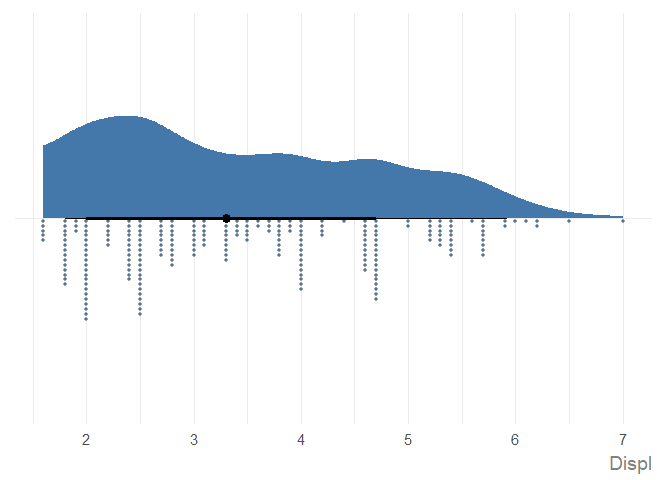

Note the symmetric x-axis, which is added then 0 exists in the range of
x values. Since the output of `ggauto()` is simply a `ggplot2` chart,
you can override this if you don’t want it:

``` r
library(ggplot2)
```

``` r
ggauto(plot_data$v1) +
  scale_x_continuous()
#> Scale for x is already present.
#> Adding another scale for x, which will replace the existing scale.
```


You’ll get a warning to say you are replacing the existing scale which
you can ignore because it’s what you’re trying to do!

You can a title, subtitle, caption, and labels with the `labs()`
function in `ggplot2` as you normally would, or directly using the same
arguments in `ggauto()`. The latter is recommended as the arguments are
used a little abnormally to implement the styling. You can add markdown
formatting into the title, subtitle, or caption:

``` r
ggauto(plot_data$v1,
  title = "Descriptive title goes here",
  subtitle = "More information about what's in the chart which can be a really, really long sentence that will wrap onto multiple lines automatically.",
  caption = "**Source**: where the data is from",
  xlab = "Nice variable name"
)
```

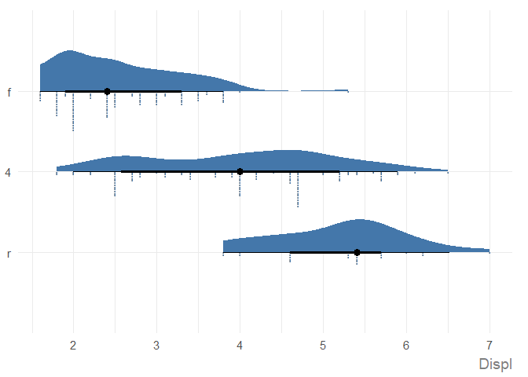

### Two continuous variables

Let’s create a basic dataset with two continuous variables:

``` r
set.seed(123)
plot_data <- data.frame(
  v1 = runif(20),
  v2 = runif(20, -5, 5)
)
ggauto(plot_data$v1, plot_data$v2)
```

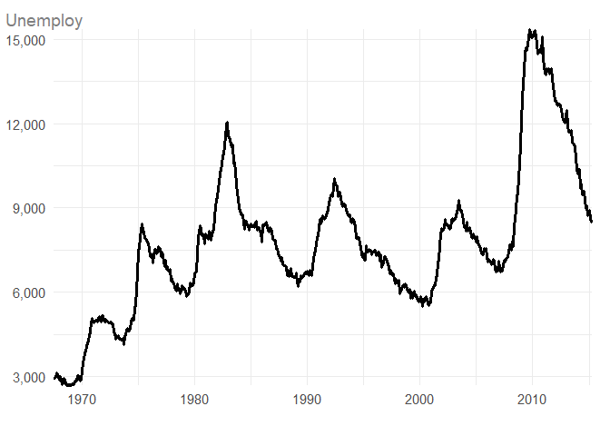

Compare to a basic, default scatter plot in `ggplot2`:

``` r
ggplot(
  data = plot_data,
  mapping = aes(x = v1, y = v2)
) +
  geom_point()
```

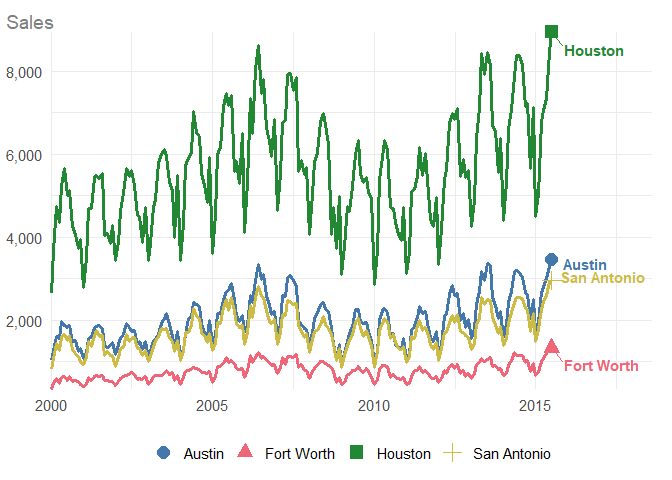

### Two continuous variables, one discrete

``` r
set.seed(123)
plot_data <- data.frame(
  v1 = runif(20),
  v2 = runif(20, -5, 5),
  v3 = sample(LETTERS[1:4], 20, replace = TRUE)
)
ggauto(plot_data$v1, plot_data$v2, plot_data$v3)
```

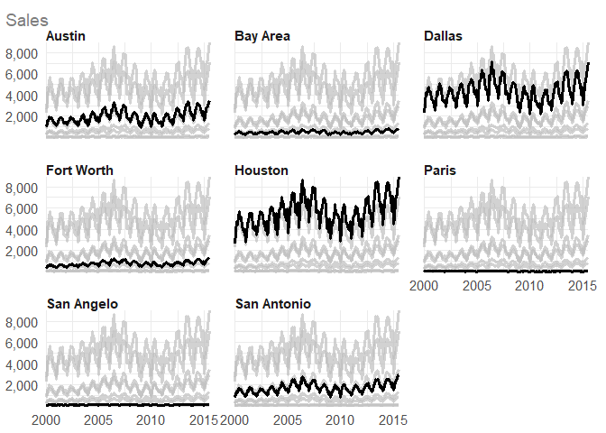

### One date variable, one continuous variable

``` r
set.seed(123)
plot_data <- data.frame(
  v1 = seq(
    as.Date("01-01-2024", tryFormats = "%d-%m-%Y"),
    as.Date("01-12-2024", tryFormats = "%d-%m-%Y"),
    by = "months"
  ),
  v2 = runif(12, -5, 5)
)
ggauto(plot_data$v1, plot_data$v2)
```

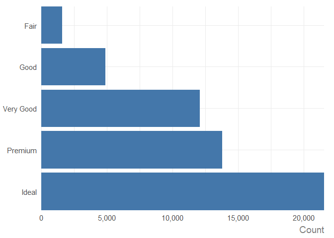

### One date variable, one continuous variable, one discrete variable

Category labels are added at the end of each line automatically. At the
moment, you will need to manually adjust the x axis to make sure they
fit in (depending on the length of your category labels).

``` r
set.seed(123)
plot_data <- data.frame(
  v1 = rep(seq(
    as.Date("01-01-2024", tryFormats = "%d-%m-%Y"),
    as.Date("01-12-2024", tryFormats = "%d-%m-%Y"),
    by = "months"
  ), each = 4),
  v2 = runif(48),
  v3 = rep(LETTERS[1:4], times = 12)
)
ggauto(plot_data$v1, plot_data$v2, plot_data$v3) +
  scale_x_date(limits = as.Date(c("01-01-2024", "31-12-2024"),
    tryFormats = "%d-%m-%Y"
  ))
```

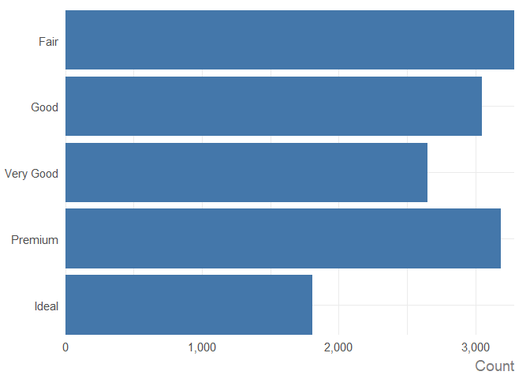

If you try to use more than 6 colours, an error will be returned. Future
iterations of this package may automatically use small multiples
(facets) in this situation.

``` r
set.seed(123)
plot_data <- data.frame(
  v1 = rep(seq(
    as.Date("01-01-2024", tryFormats = "%d-%m-%Y"),
    as.Date("01-12-2024", tryFormats = "%d-%m-%Y"),
    by = "months"
  ), each = 7),
  v2 = runif(84),
  v3 = rep(LETTERS[1:7], times = 12)
)
ggauto(plot_data$v1, plot_data$v2, plot_data$v3)
#> Error in `ggauto()`:
#> ! You cannot use more than 6 colours.
```

## One discrete variable

If a `character` variable, will be sorted highest to lowest:

``` r
set.seed(123)
plot_data <- data.frame(
  v1 = sample(LETTERS[1:6], 20, replace = TRUE)
)
ggauto(plot_data$v1)
```

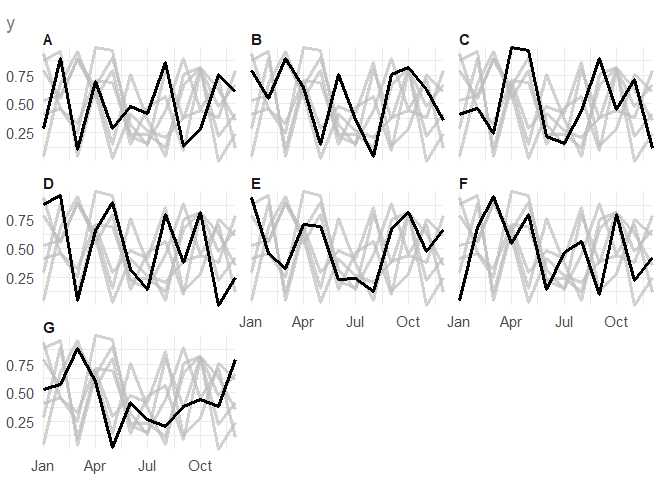

If a `factor` variable, the order is respected:

``` r
plot_data$v1 <-factor(plot_data$v1, levels = LETTERS[1:6])
ggauto(plot_data$v1)
```

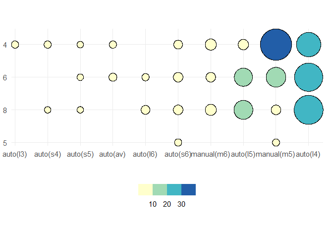

## One discrete variable, one continuous variable

If only one continuous value for each discrete variable, a bar chart is
created e.g. if you’ve pre-computed the counts:

``` r
set.seed(123)
plot_data <- data.frame(
  v1 = LETTERS[1:6],
  v2 = rpois(6, 6)
)
ggauto(plot_data$v1, plot_data$v2)
```

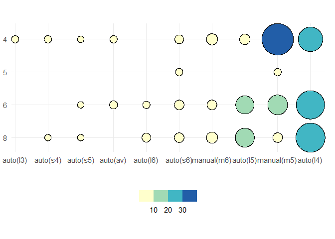

If multiple continuous values for each discrete variable, a raincloud
plot is created:

``` r
set.seed(123)
plot_data <- data.frame(
  v1 = rep(LETTERS[1:3], each = 25),
  v2 = rnorm(75)
)
ggauto(plot_data$v1, plot_data$v2)
```

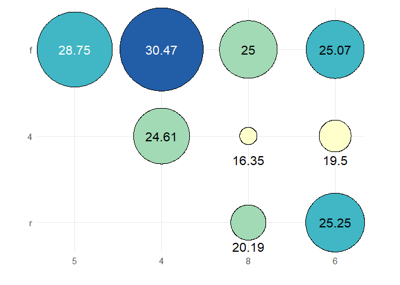
