# Examples

``` r

library(ggauto)
```

## Examples

We’ll be using some of the built-in datasets from `ggplot2` in these
examples, so we’ll load the package here:

``` r

library(ggplot2)
```

### Visualising distributions

If you have only **continuous variable** and you want to visualise the
distribution, for example:

``` r

mpg |>
  ggauto(displ)
```


You can pass the data directly instead of using the pipe:

``` r

ggauto(mpg, displ)
```

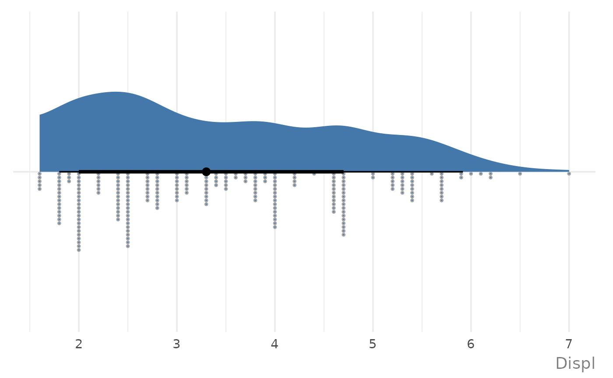

Or pass it in as a vector:

``` r

ggauto(mpg$displ)
```


If you have multiple categories, and you want to visualise the
distribution for each of them, i.e., you have **one discrete variable,
and one continuous variable**, then multiple raincloud plots are
produced.

``` r

mpg |>
  ggauto(drv, displ)
```

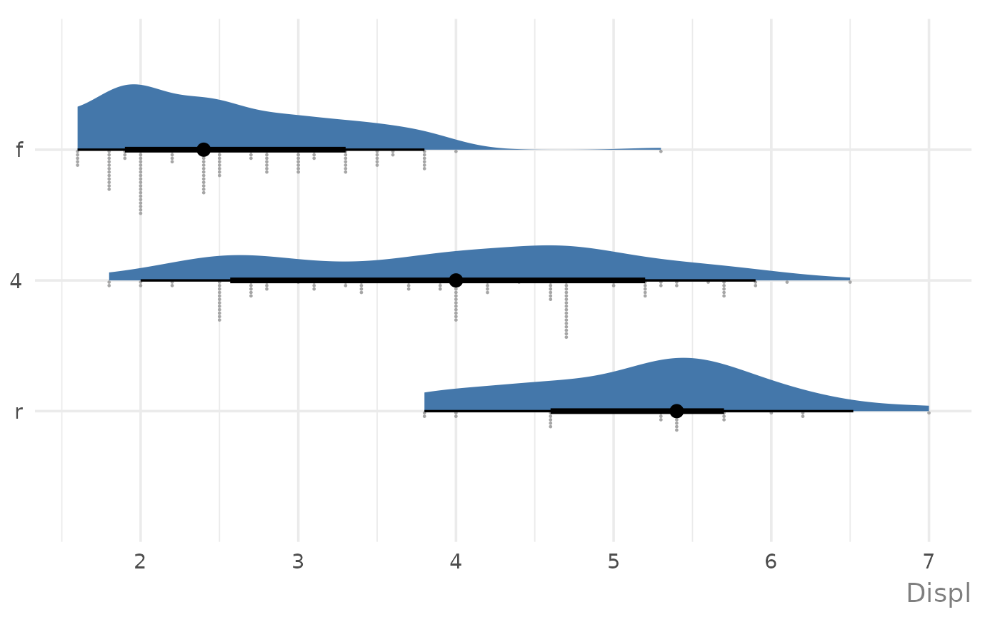

### Visualising data over time

If you have a single variable to show over time, i.e., **one date
variable, and one continuous variable**:

``` r

economics |>
  ggauto(date, unemploy)
```

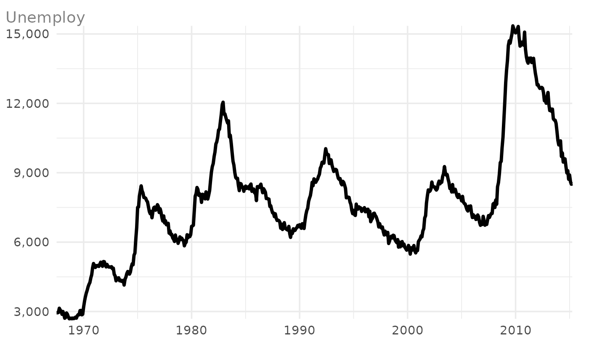

a line chart is produced.

If you need to show how multiple variables change over time, i.e., **one
date variable, continuous variable, and one discrete variable**, the
type of chart will depend on how many categories (unique values in the
discrete variable) you have.

If you have 6 or fewer categories, a multi-line chart is created, with
colours and symbols identifying the categories. Category labels are
added at the end of each line automatically.

``` r

txhousing |>
  dplyr::filter(city %in% c("Houston", "Fort Worth", "San Antonio", "Austin")) |>
  dplyr::mutate(date = lubridate::ymd(paste0(year, "/", month, "/01"))) |>
  ggauto(date, sales, city)
```

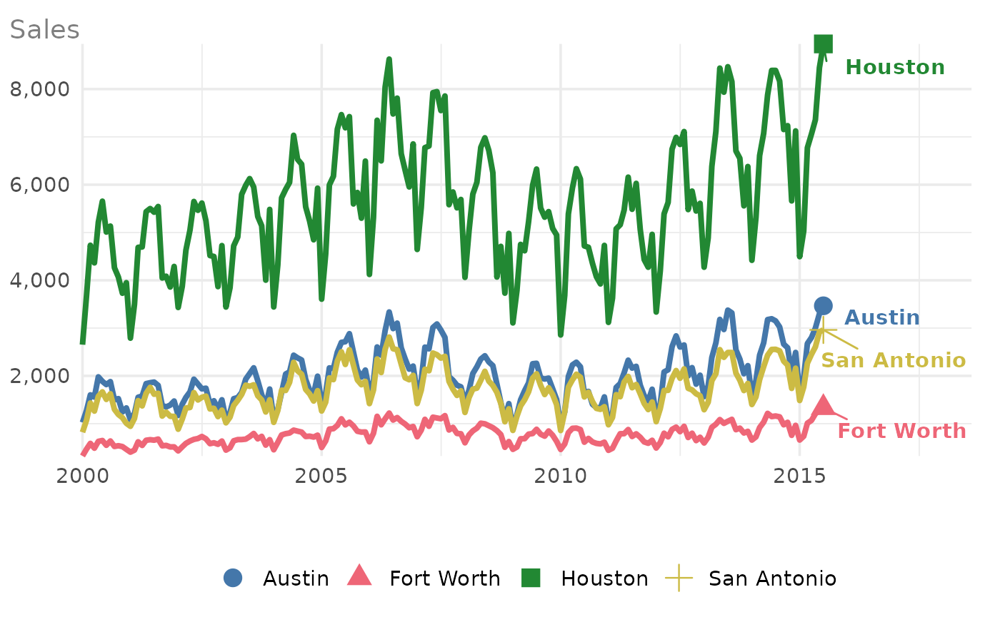

If you have more than 6 categories, the plot type changes to a faceted
line chart, with one category highlighted on each facet:

``` r

txhousing |>
  dplyr::filter(city %in% c(
    "Houston", "Fort Worth", "San Antonio", "Austin",
    "Bay Area", "Dallas", "Paris", "San Angelo"
  )) |>
  dplyr::mutate(date = lubridate::ymd(paste0(year, "/", month, "/01"))) |>
  ggauto(date, sales, city)
```

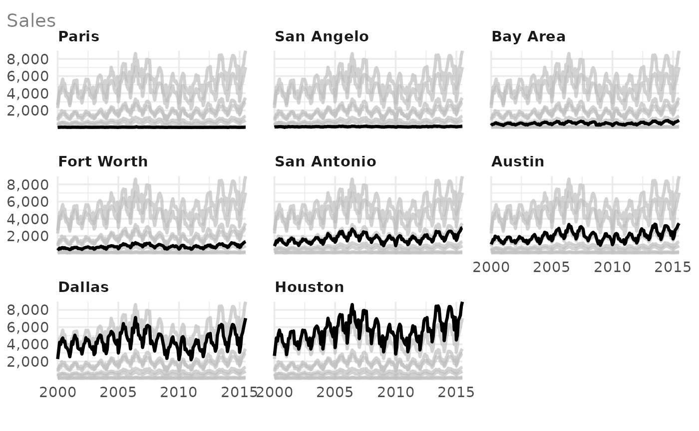

### Visualising magnitudes and ranks

If you have a single discrete variable, a bar chart showing the counts
of each category is created:

``` r

diamonds |>
  ggauto(cut)
```

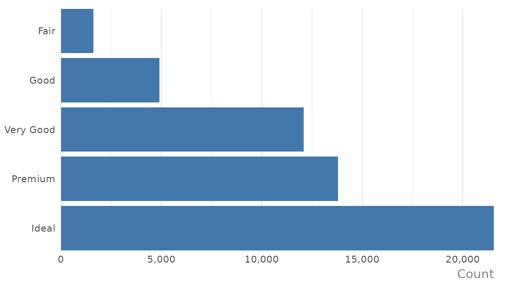

If you have pre-computed the counts or some other summary statistics,
i.e., if you have **one discrete variable, and one continuous variable**
with only a single value for each discrete variable, a bar chart of the
values is created:

``` r

diamonds |>
  dplyr::group_by(cut) |>
  dplyr::summarise(median_price = median(price)) |>
  ggauto(cut, median_price)
```

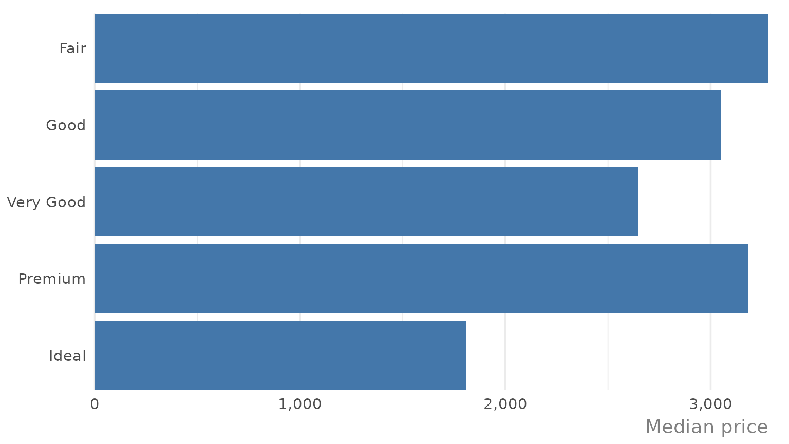

As you can see, when the discrete variable is a factor (i.e. `cut`), the
desired order is respected. If the discrete variable is not a factor,
the bars are ordered from highest to lowest instead of the default
alphabetical ordering:

``` r

diamonds |>
  dplyr::group_by(cut) |>
  dplyr::summarise(median_price = median(price)) |>
  dplyr::mutate(cut = as.character(cut)) |>
  ggauto(cut, median_price)
```

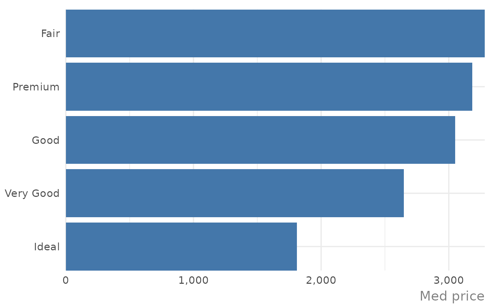

If you have **two discrete variables**, then a heatmap is created
showing the count of each combination of categories. Labels are added
showing the count.

``` r

mpg |>
  dplyr::mutate(cyl = as.character(cyl)) |>
  ggauto(cyl, drv)
```

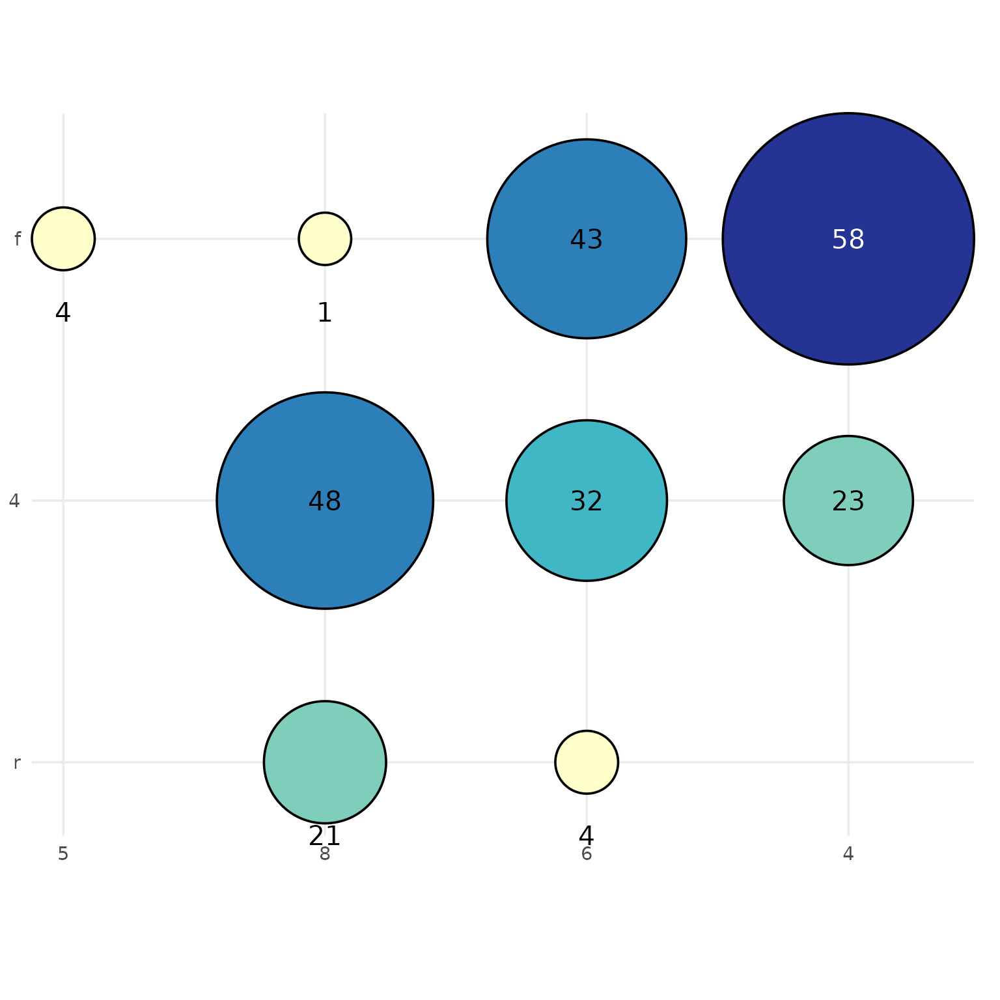

If there are more than 6 categories on either axis, labels are replaced
with a legend:

``` r

mpg |>
  dplyr::mutate(cyl = as.character(cyl)) |>
  ggauto(trans, cyl)
```

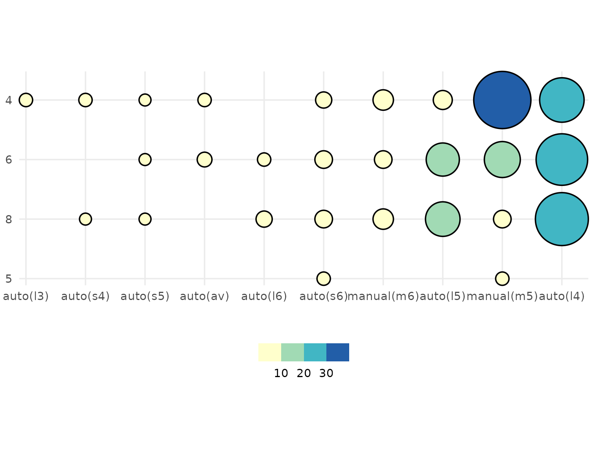

Again, if one or both of the discrete variables is a factor, then the
order is respected:

``` r

mpg |>
  dplyr::mutate(cyl = as.factor(cyl)) |>
  ggauto(trans, cyl)
```

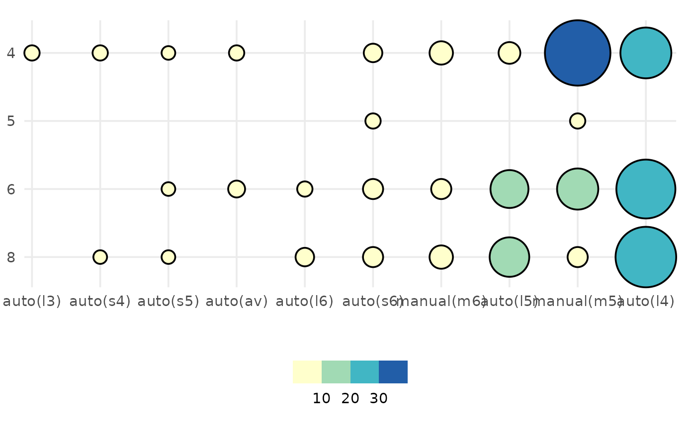

If you have **two discrete variables** and a third **continuous
variable** showing some summary statistic for each category combination,
a heatmap showing that value is created. Labels are rounded to 2 decimal
places.

``` r

mpg |>
  dplyr::mutate(cyl = as.character(cyl)) |>
  dplyr::group_by(cyl, drv) |>
  dplyr::summarise(mean_hwy = mean(hwy), .groups = "drop") |>
  ggauto(cyl, drv, mean_hwy)
```

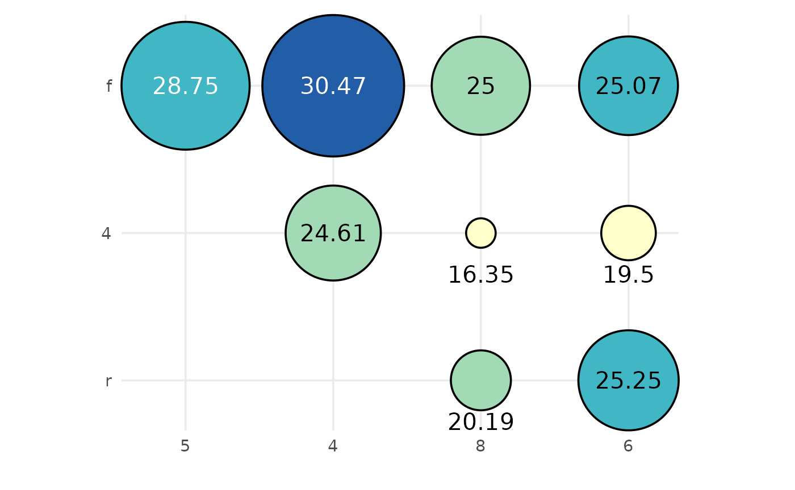

If there are multiple continuous values per combination of categories,
and error is returned, asking you to first summarise the data:

``` r

mpg |>
  dplyr::mutate(cyl = as.character(cyl)) |>
  ggauto(cyl, drv, hwy)
#> Error in `ggauto()`:
#> ! Too many values per category. Summarise data first.
```

### Visualising correlation

To show the correlation between **two continuous variables**:

``` r

mpg |>
  ggauto(displ, hwy)
```

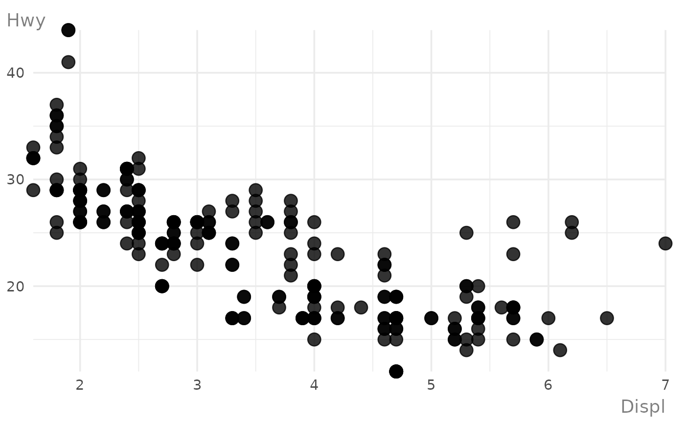

To show the correlation between **two continuous variables**, split by a
third **discrete** variable, a scatter plot using colours and shapes is
created:

``` r

mpg |>
  dplyr::mutate(cyl = as.factor(cyl)) |>
  ggauto(displ, hwy, cyl)
```

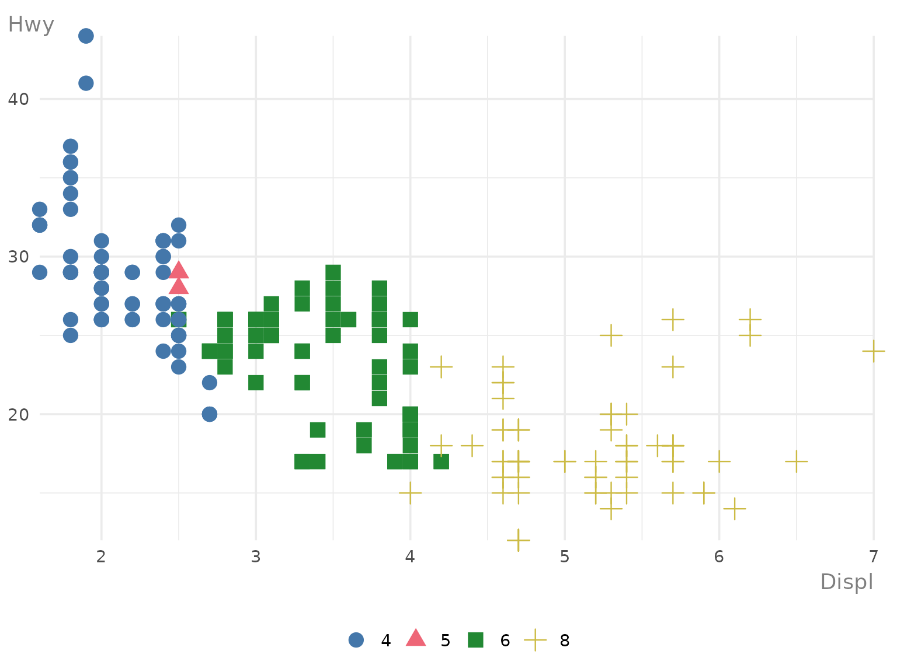

If you try to use more than 6 colours (categories), the chart type
changes to a faceted scatter plot with one category highlighted on each
facet:

``` r

mpg |>
  dplyr::mutate(cyl = as.factor(cyl)) |>
  ggauto(displ, hwy, manufacturer)
```

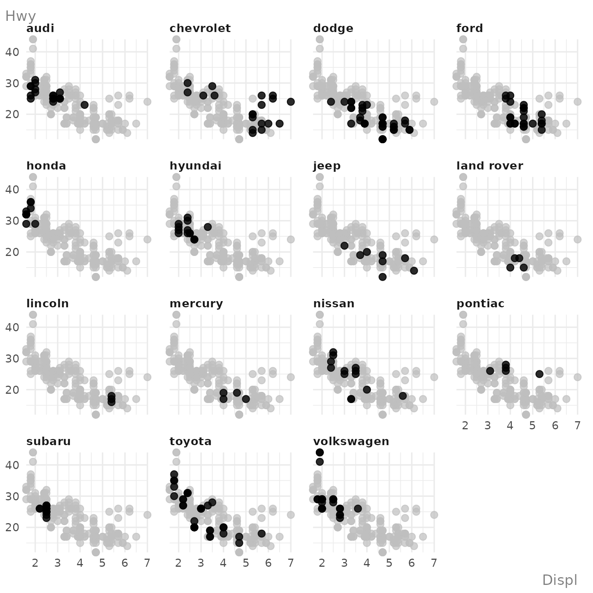

## Editing charts

### Scales

For scatter plots, raincloud plots, and line charts, one or both of the
axes may be symmetric about 0 by default. This happens automatically
when 0 exists in the range of values. Since the output of
[`ggauto()`](https://nrennie.rbind.io/ggauto/reference/ggauto.md) is
simply a `ggplot2` chart, you can override this if you don’t want it:

``` r

set.seed(123)
plot_data <- data.frame(
  v1 = rnorm(50, 1)
)
```

``` r

ggauto(plot_data, v1) +
  scale_x_continuous()
#> Scale for x is already present.
#> Adding another scale for x, which will replace the existing scale.
```

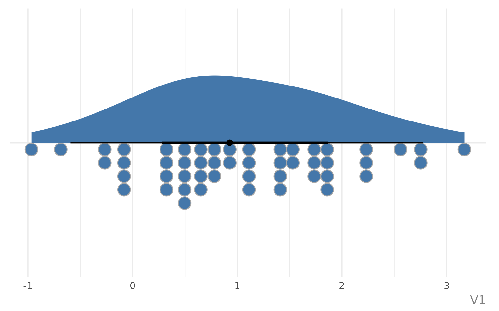

You’ll get a warning to say you are replacing the existing scale which
you can ignore because it’s what you’re trying to do!

Similarly, you can edit the default colour/fill scales. However, the
default palette is chosen to be accessible.

### Text

You can a title, subtitle, caption, and labels with the
[`labs()`](https://ggplot2.tidyverse.org/reference/labs.html) function
in `ggplot2` as you normally would, or directly using the same arguments
in [`ggauto()`](https://nrennie.rbind.io/ggauto/reference/ggauto.md).
The latter is recommended as the arguments are used a little abnormally
to implement the styling. You can add markdown formatting into the
title, subtitle, or caption:

``` r

plot_data |>
  ggauto(v1,
    title = "Descriptive title goes here",
    subtitle = "More information about what's in the chart which can be a really, really long sentence that will wrap onto multiple lines automatically.",
    caption = "**Source**: where the data is from",
    xlab = "Nice variable name"
  )
```

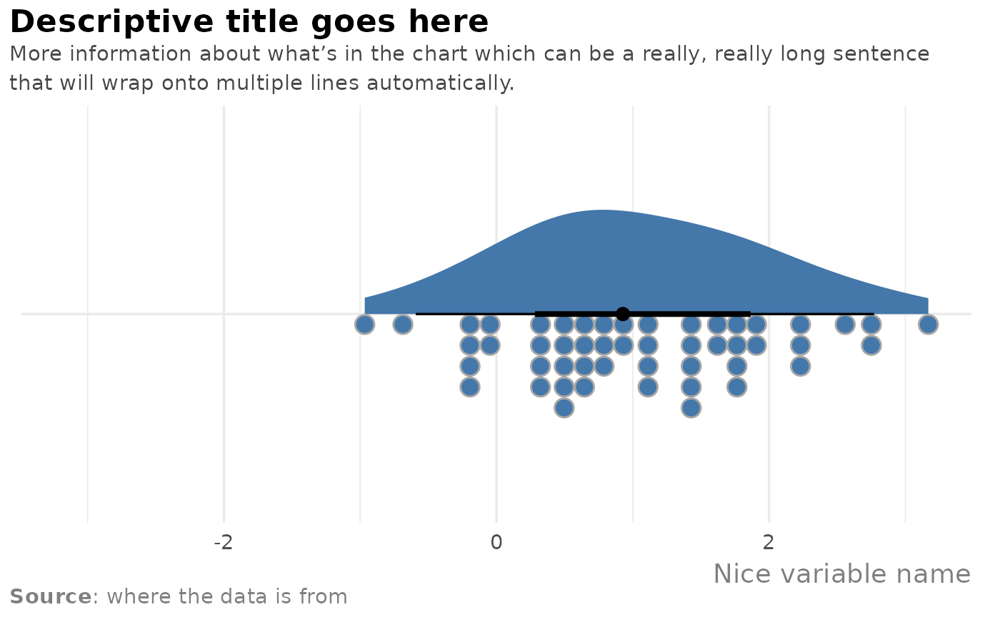

By default, the x or y axis title is removed on chart types e.g. where
the axis is a date or category and a further label stating that is
unnecessary. Unless otherwise specified, the axis labels are clean
versions of the column names where it’s parsed in sentence case, with
underscores removed.

You can edit the size and family of the text using the `base_size` and
`base_family` arguments. Other plot elements e.g. lines and points scale
relative to the `base_size` as well.
